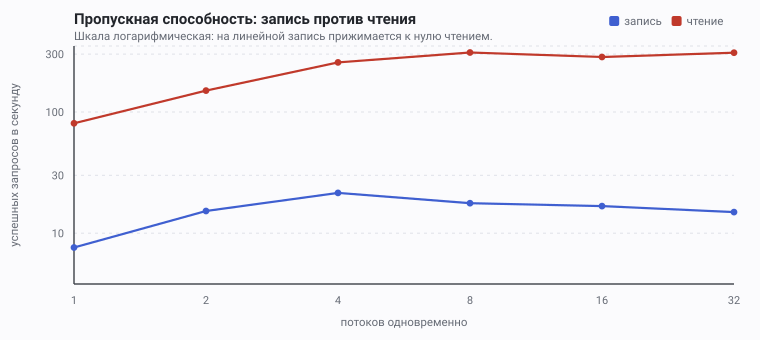
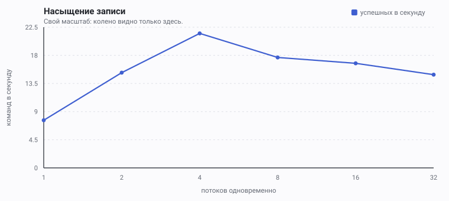
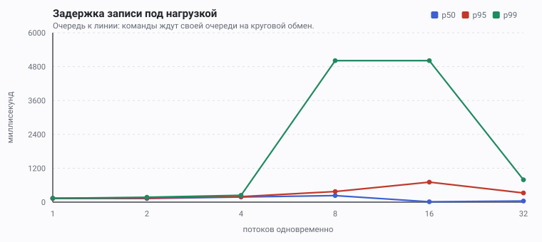
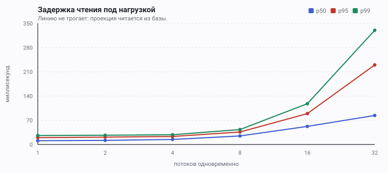
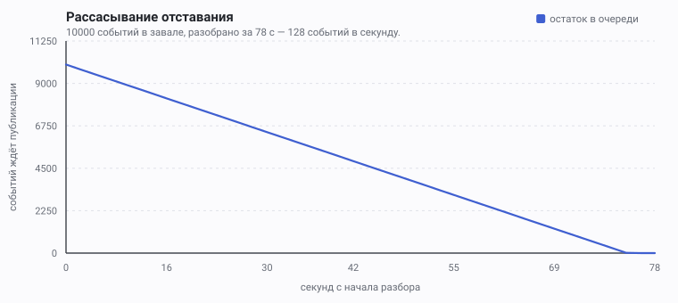

# Нагрузочный профиль Sonder

Отчёт гейта Ф10. Все числа здесь — **измеренные**, а не рассчитанные:
воспроизводятся командой `./sonder bench` против поднятого состава.
Таблицы и графики порождаются `ops/bench/report.py` из тех же JSON, что
пишет нагрузка; править их руками нельзя — при следующем замере правка
исчезнет, а до тех пор будет врать.

## Что здесь измеряется и почему именно это

Sonder устроен так, что **запись и чтение идут разными путями**, и пути
эти несопоставимы по стоимости.

Запись — это команда доменному ядру, а ядро живёт под эмулятором DOS и
разговаривает через нульмодем на 11 520 бод. Каждая команда — круговой
обмен по линии. Спайк S2 измерил линию отдельно: 11 503 Б/с и 13 мс
постоянных накладных на обмен, не зависящих от скорости передачи.
Отсюда и оценка [ADR-0011](adr/0011-pascal-domain-core.md): «порядка
десяти операций в секунду», и она названа **потолком записи всего
приложения**.

Чтение линию не трогает вовсе: лента и профиль читаются из проекций,
которые обновляет дренаж outbox ([ADR-0016](adr/0016-events-owns-its-data.md)).

Потолок записи, таким образом, — не свойство железа и не следствие
неудачного кода. Это **заявленное свойство конструкции**, и отчёт
существует затем, чтобы подтвердить его числом, а не сослаться на
рассуждение.

## Условия замера

| | |
|---|---|
| Состав | `docker compose up`: Firebird 5, оболочка на Java 8, NODE-7 под DOSBox, nginx |
| Транспорт | HTTPS с HTTP/2, самоподписанный сертификат — тот же путь, что у людей |
| Ядро | настоящее, шестнадцатибитное, за нульмодемом |
| Нагрузка | `ops/bench/load.py`, стандартная библиотека Python, потоки |
| Уровни | 1, 2, 4, 8, 16, 32 одновременных потока |
| Длительность | 15 с на уровень |
| Пишущих | 160 учётных записей |
| Фоновая нагрузка | никакой: фаззер остановлен на время замера |

**Пишущих много не для красоты.** Домен разрешает 20 постов в час на
человека ([limits.yaml](../contracts/domain/limits.yaml)). Упершись в
это правило, замер измерял бы скорость, с которой система отвечает
`429`, — а вовсе не потолок записи. Первый прогон именно так и вышел:
при четырёх потоках 60 успешных против 83 отвергнутых. Пишущие теперь
берутся из общей очереди и идут по кругу, а не закрепляются за потоком.

## Пропускная способность



Шкала логарифмическая. На линейной линия записи прижимается к нулю
линией чтения, и форма её — а форма и есть насыщение — перестаёт быть
различимой.



## Задержка





## Рассасывание отставания



Отдельный замер, `./sonder drain-bench 10000`: очередь набивается
десятью тысячами событий и разбирается насосом до дна — ровно так, как
разбиралась бы после простоя потребителя. Обогащение настоящее, через
ORB; проекция настоящая; база настоящая.

**График здесь нужен не для красоты.** Одно итоговое число — «десять
тысяч за семьдесят восемь секунд» — одинаково описывает ровный разбор и
разбор, который минуту стоял, а потом рванул. Отличить их можно только
рядом измерений, и снимается он по ходу, после каждого захода насоса.

Линия прямая, и это ответ: дренаж разбирает завал с постоянной
скоростью, не замедляясь по мере роста проекции и не ускоряясь к концу.
По вертикали — ОСТАТОК, а не опубликованное: остаток видит отстающий
читатель, опубликованным гордится потребитель.

**127 событий в секунду** на этом прогоне. Числа замера зависят от
машины сильнее прочих: он упирается в базу и обогащение, а не в линию,
и потому прямому сравнению между прогонами поддаётся плохо — предыдущий
дал 82 события в секунду на том же завале.

Сравнивать это с пятьюстами из спайка S5 нельзя, и раньше в этом файле
стояло именно такое сравнение: S5 мерил ГОЛЫЙ круг по IIOP, а здесь на
каждое событие приходится вызов обогащения плюс четыре обращения к базе
— выборка пачки, два `MERGE`, отметка. Пятьсот — это потолок одного
звена, а не конвейера.

## Числа

Полные таблицы — в [bench/SUMMARY.md](bench/SUMMARY.md), порождаются
замером.

| | запись | чтение |
|---|---:|---:|
| потолок без отказов | **21,5 команд/с** | **309,6 запросов/с** |
| на скольких потоках | 4 | 8 |
| p50 на потолке | 182 мс | 25 мс |
| p95 на потолке | 197 мс | 36 мс |

Отношение — **×14**.

## Что из этого следует

**Потолок записи подтверждён и оказался вдвое выше оценки.** ADR-0011
называл порядок десяти команд в секунду; измерено 21,5. Расхождение не
случайно и не в пользу «повезло»: оценка считала обмены
последовательными, а мультиплексор линии держит шестнадцать каналов и
ведёт команды внахлёст. Тринадцать миллисекунд накладных платятся не за
каждую команду по очереди, а перекрываются между ними. Порядок величины
оценка угадала, коэффициент — нет.

Один поток даёт 7,6 команд/с при p50 132 мс. Это и есть цена одной
команды в одиночку: SOAP-конверт по линии туда, решение обратно, запись
в базу вместе со строкой outbox одной транзакцией.

**Колено — на четырёх потоках.** Дальше пропускная способность не
растёт: линия занята целиком, и добавленные потоки лишь удлиняют
очередь к ней. Это видно и по задержке — p50 растёт с 132 мс до 233 мс
между четырьмя и восемью потоками, тогда как отдача падает.

**За коленом система ОТКАЗЫВАЕТ, а не деградирует молча.** Начиная с
восьми потоков появляются ответы `502 DECIDER_UNAVAILABLE`, и p99
упирается в 5011 мс — это ровно предел ожидания ядра
(`SONDER_DECIDER_LINE_TIMEOUT_MS`, 5000 мс) плюс накладные. Команда,
не дождавшаяся решения, получает названный код из
[errors.yaml](../contracts/errors), а не тишину и не выдуманный успех.

Это правильное поведение, и оно важнее самого числа. Система с узким
местом в 21 команду в секунду, честно отказывающая на 22-й, пригодна к
эксплуатации: отказ виден, у него есть код, и клиент знает, что
повторить осмысленно. Система, которая в той же точке начинает молча
терять команды или отвечать через минуту, — нет.

**Потолок записи считать надо по уровню БЕЗ отказов.** На шестнадцати
потоках «пропускная способность» формально составляет 16,7 команд/с при
572 отказах: часть работы просто выброшена. Объявить такое число
достижением значило бы записать в заслуги скорость, с которой система
говорит «нет».

**Чтение живёт в другом мире.** 309 запросов в секунду против 21,5 —
разница в четырнадцать раз, и она не про оптимизацию, а про
конструкцию: чтение не ходит к ядру. Отсюда следствие для
эксплуатации — масштабировать чтение можно обычными средствами
(реплики, кэш, ещё один экземпляр оболочки), а запись не масштабируется
ничем, кроме замены линии. Планы отхода перечислены в
[RISKS.md](RISKS.md), R2.

## Что будет при росте

Вопрос «выдержит ли тысячу пользователей, десять тысяч» имеет числовой
ответ, и ниже он выведен из замеров, а не из ощущений.

### Колено чтения

Замер до 32 потоков показывал рост; прогон до 128 показал полку.

| Потоков | Запросов/с | p50 | p95 | p99 |
|--------:|-----------:|----:|----:|----:|
| 8 | 232 | 32 мс | 57 мс | 74 мс |
| 16 | 269 | 56 мс | 96 мс | 124 мс |
| 32 | 276 | 96 мс | 254 мс | 351 мс |
| 64 | 284 | 168 мс | 545 мс | 783 мс |
| 128 | 292 | 317 мс | **1138 мс** | 1686 мс |

**Колено — на 8–16 потоках.** Дальше пропускная способность прибавляет
четверть, а задержка растёт в двадцать раз: всё, что за коленом, — это
очередь, а не работа. Практический потолок чтения — около **270
запросов/с при p95 меньше 100 мс**.

### Сколько это пользователей

Считая активного пользователя как один запрос раз в десять секунд:

| | 1000 пользователей | 10 000 |
|---|---|---|
| Чтение | 100 зап/с — 37 % колена, p95 ≈ 60 мс | 1000 зап/с — вчетверо выше колена |
| Запись при 2 действиях в час | 0,6 к/с — 3 % потолка | 5,6 к/с — 26 % |
| Запись при полной квоте домена (20/час) | 5,6 к/с — 26 % | 55 к/с — **вдвое с половиной выше потолка** |

Точка перелома по записи считается одной строкой: 21,5 команды/с ×
3600 = **77 400 команд в час на всё приложение**. Разделив на десять
тысяч пользователей, получаем **7,7 действий на человека в час** — и
это предел, который не сдвигается железом.

### Масштабирование вширь: измерено, и результат неприятный

Чтение не ходит к ядру, и напрашивается вывод «добавим экземпляр
оболочки». Опыт с двумя экземплярами дал три числа:

1. **nginx слал 20 запросов из 20 в ОДИН экземпляр.** `proxy_pass` с
   именем в адресе резолвит его однажды, при чтении конфигурации, и
   запоминает единственный адрес. Второй экземпляр был невидим —
   масштабирование не давало ничего, даже по чтению. Исправлено:
   резолвер Docker с `valid=10s` и адрес через переменную заставляют
   перечитывать запись.

2. **Ядро видит только ОДИН экземпляр.** Нульмодем — одно соединение к
   одному процессу; нода подключается к тому, кого ей вернул DNS.

3. **Экземпляр без линии не принимает команд вовсе:** прямой запрос
   отвечает `502 DECIDER_UNAVAILABLE`. Честно, но клиенту от этого не
   легче, поэтому nginx теперь пробует следующий экземпляр
   (`proxy_next_upstream`).

Отсюда правило, которое стоит записать прямо: **оболочка масштабируется
вширь ТОЛЬКО по чтению.** Линия — ресурс в единственном экземпляре, и
команды обязаны идти через того, кто ею владеет. Наивное
масштабирование до недавнего изменения не давало ни чтения, ни записи, а
после него даёт чтение и заставляет часть команд ходить со второй
попытки.

## Как повторить

```bash
./sonder up
./sonder bench
```

Уровни, длительность и число пишущих меняются переменными
`SONDER_BENCH_LEVELS`, `SONDER_BENCH_SECONDS`, `SONDER_BENCH_USERS`.

Замер занимает около четырёх минут и создаёт в базе несколько сотен
учётных записей и постов. Это осознанно: нагрузка на пустой системе
меряет пустую систему.
